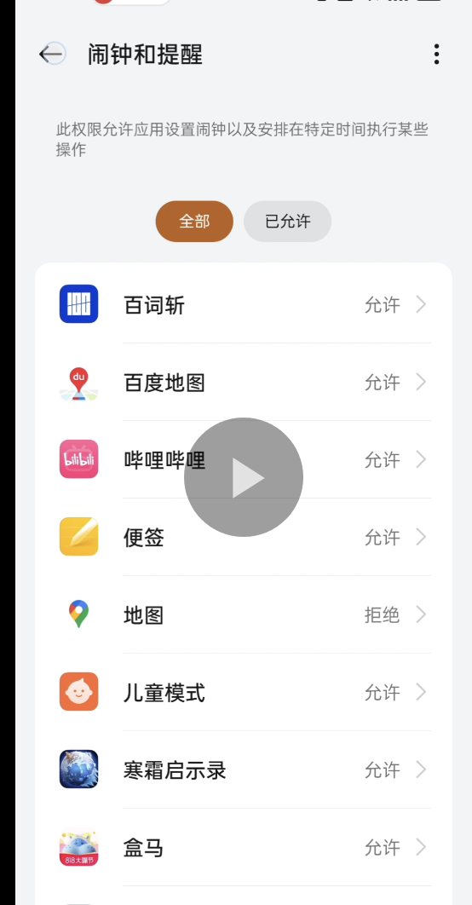

## 修复Android12及以上本地推送收不到的问题

修改前：

```java
final PendingIntent pendingIntent = PendingIntent.getBroadcast(androidContext, localNotification.code.hashCode(), intent, 0);
```

参考文档：https://www.flybuy.com/android-12-pendingintent-mutability-and-geofences

重点：Apps that target Android 12 (SDK31) must now [specify a mutability flag for any pending intents.](https://developer.android.com/about/versions/12/behavior-changes-12#pending-intent-mutability) 

即Android12及其以上对于任一的pending intent都需要设置一个mutability的标识位，否则pending event不会得到触发。

修改后:

```java
int pendingIntentFlags = PendingIntent.FLAG_UPDATE_CURRENT;
if (Build.VERSION.SDK_INT >= Build.VERSION_CODES.S) {
    pendingIntentFlags |= PendingIntent.FLAG_IMMUTABLE; // 使用适当的标志
}
final PendingIntent pendingIntent = PendingIntent.getBroadcast(androidContext, localNotification.code.hashCode(), intent, pendingIntentFlags);
```


原有的本地推送代码针对Android6.0（Build.VERSION_CODES.M）以及以上还使用了精准闹钟的接口：

```java
AlarmManager am = (AlarmManager)androidActivity.getSystemService(Context.ALARM_SERVICE);
am.setExactAndAllowWhileIdle(AlarmManager.RTC_WAKEUP, notificationTime, pendingIntent);
```

参考文档：

https://stackoverflow.com/questions/71031091/android-12-using-schedule-exact-alarm-permission-to-get-show-data-at-specific-t

https://developer.android.com/about/versions/14/changes/schedule-exact-alarms

可见如果想要调用如下几个API：

- setExact()

- setExactAndAllowWhileIdle()

- setAlarmClock()

  是需要`SCHEDULE_EXACT_ALARM`权限的，否则会抛出SecurityException异常。

`SCHEDULE_EXACT_ALARM`权限正是在Android12中引入的，Android12会自动授权，但Android13以及以上会默认拒绝该权限。

最佳实践是如需调用精准闹钟的API，则需要在调用前使用canScheduleExactAlarms()接口进行判断，有权限调用精准闹钟API，没有权限应该进行fallback。

修改后:

```xml
<uses-permission android:name="android.permission.SCHEDULE_EXACT_ALARM" />
```

```java
AlarmManager am = (AlarmManager)androidActivity.getSystemService(Context.ALARM_SERVICE);
if (Build.VERSION.SDK_INT >= Build.VERSION_CODES.S) {
    if (am.canScheduleExactAlarms()) {
        am.setExactAndAllowWhileIdle(AlarmManager.RTC_WAKEUP, notificationTime, pendingIntent);
		} else {
     		am.set(AlarmManager.RTC_WAKEUP, notificationTime, pendingIntent);
    }
}
```

请求权限的示例代码：

```java
public void requestExactAlarmPermission() {
    AlarmManager am = (AlarmManager) mActivity.getSystemService(Context.ALARM_SERVICE);
    if (Build.VERSION.SDK_INT >= Build.VERSION_CODES.S) {
          if (!am.canScheduleExactAlarms()) {
                Intent alarmIntent = new Intent(Settings.ACTION_REQUEST_SCHEDULE_EXACT_ALARM);
                mActivity.startActivity(alarmIntent);
          }
    }
}
```

没有授权的用户会导航到如下的页面：




其他参考文档：

通知权限相关：

https://help.moengage.com/hc/en-us/articles/16768530490132-Android-Push-Permission-and-Reachability#h_01HBT39SSWEJKYS15SSNJ0NARH

WorkManager实现：

https://medium.com/@munbonecci/how-to-launch-a-local-notification-in-android-afaa47eb1d1c

Alarm权限说明：

https://proandroiddev.com/quick-guide-of-alarms-on-android-12-3a864ea81910
